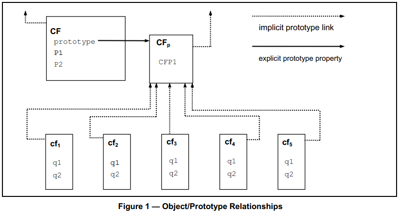

# 4 综述

本章节只包含了ECMAScript的非规范性的概况。

ECMAScript是一种面向对象的编程语言，它在宿主环境中运行计算，操作计算的对象。在这里定义的ECMAScript没想过要独立自主地运行计算，事实上，本规范不提供外部数据输入或计算结果输出的规范。相反，希望ECMAScript的运行环境除了提供本规范中描述的对象和其他设施以外，还提供运行环境的宿主对象等。它们是指可以从ECMAScript程序中访问的某些属性和某些函数，关于这些行为和具体描述超出了本规范范围。

脚本是指用来操作、自定义和自动化已存在系统的设备的一种编程语言。在这样的系统中，通过用户接口一些很有用的功能已经存在了，脚本语言是把已有的功能暴露给程序控制的一种机制。就这样，给定系统就称为宿主环境，它提供对象和设备，并完成对脚本语言的兼容。脚本语言是同时为专业和非专业的程序员所准备的。

ECMAScript起初被设计为Web脚本语言，它提供一种机制，让浏览器中Web页面更加生动，并运行基于页面的客服端/服务器（C/S）架构的计算。ECMAScript能为各式各样的宿主环境提供核心的脚本兼容，因此本规范中的核心脚本语言和特定的宿主环境没有任何关系。

ECMAScript中的一些设施和其他编程语言中用到的类似，尤其是Java™，Self和Scheme，在如下参考中有提到：

Gosling, James, Bill Joy and Guy Steele. The Java™ Language Specification. Addison Wesley Publishing Co., 1996. 

Ungar, David, and Smith, Randall B. Self: The Power of Simplicity. OOPSLA '87 Conference Proceedings, pp. 227–241, Orlando, FL, October 1987. 

IEEE Standard for the Scheme Programming Language. IEEE Std 1178-1990.

## 4.1 Web脚本编程

浏览器为客户端计算提供一个ECMAScript宿主环境，例如包括表示窗口、菜单、弹出框、对话框、文本块集合、锚点集合、框架集合、历史记录、cookies和输入/输出的各种对象。高级情况，宿主环境还提供把代码绑定到事件的方法，例如焦点变化、页面和图片的加载/卸载/出错/中断、选区、表单递交和鼠标动作等。脚本代码出现在HTML中，而被显示的页面是一个由各种用户界面元素、固定的和计算出来的文本和图片所组成的有机整体。脚本代码响应用户交互而并不需要一个主程序。

Web服务器为服务端计算提供一个不同的宿主环境，包括表示请求、客户端和文件等对象，以及锁定和共享数据等操作。通过同时使用浏览器端和服务器端脚本，假设为一个基于页面的应用提供自定义的用户接口，在客户端和服务器之间分布计算就成为了可能。

每个支持ECMAScript的浏览器和服务器实现了它自己的宿主环境，完成ECMAScript的执行环境。

## 4.2 语言综述 

以下叙述并非正式ECMAScript概述——并非语言的所有部分都会提到。此综述非标准文档的一部分。

ECMAScript是基于对象的：基础语言和宿主设备通过对象提供的，ECMAScript程序是一个各种互相通信的对象簇。每个ECMAScript对象是一个属性集合，每个属性有零个或多个特性值组成，它们决定了当属性被使用时程序是如何表现的。例如，当一个属性的可写（Writable）特性值设置为false时，执行的代码试图修改这个属性的值时将会失败。属性是用来保存其他对象、原始值或函数的容器。每个原始值是如下一种内置类型的成员：Undefined、Null、Boolean、Number和String。每个对象是剩下的一种内置类型Object的成员。每个函数是一个可调用的对象，通过对象的属性关联起来的函数称之为方法。

在ECMAScript实体外网又定义一个内置对象组成的集合，包括全局对象、Object、Function、Array、String、Boolean、Number、Math、Date、RegExp、JSON和各种出错如Error、EvalError、RageError、ReferenceError、SyntaxError、TypeError和URIError等等对象。

ECMAScript也定义了一组内置运算符，包括各种一元、乘法、加法、位移、关系、相等、二进制按位、二进制逻辑、赋值和逗号等操作符。

ECMAScript语法有意和Java语法类似，它更从容使得它成为易用的脚本语言。例如，变量无需类型声明，属性也和类型没有关联，函数定义也无需在调用之前。

### 4.2.1 对象

ECMAScript不像C++、Smalltalk或Java一样使用类，取而代之，它的对象可能通过各种其他方法来创建，包括文本字面量或构造器——创建对象并执行代码对它们的属性进行全部或部分赋值的方式。每个构造器是一个以“prototype”命名的函数，它用来实现基于原型的继承和共享属性。通过构造器创建对象是在new表达式中实现的，例如，new Date(2009,11)创建了一个Date对象。没有使用new而调用构造器有不同的例程，这取决于构造器本身。例如，Date()产生了一个表示当前日期和时间的字符串而不是一个对象。

每一个由构造器创建的对象都有一个指向构造器的“prototype”属性值的隐式引用，称之为对象的原型。此外，一个原型可能也会有一个指向它自己的原型的非空的隐式引用，以此类推。这就是所谓的原型链。当一个对象中的属性是一个引用时，该引用是在原型链中存在的第一个以该名字命名的对象的属性。换句话说，首先检验提到的对象是否有这个属性：如果有，那个属性就是所指向的引用；如果没有，接着检验该对象的原型；以此类推。

一般来说，在基于类的面向对象的语言中，实例承载状态，类承载方法，继承的只是结构和行为。在ECMAScript中，对象承载了状态和方法，结构、行为和状态都可以继承。

不直接包含特定的属性的所有对象都共享了原型链的属性和值。如图1所示：

CF是一个构造器（也是一个对象）。使用new表达式创建了五个对象分别是：cf1、cf2、cf3、cf4和cf5。每个对象包含了名字为q1和q2的属性。点线表示隐式原型关系，故，例如cf3的原型是CFp。构造器CF自己有两个属性P1和P2，这两个属性对CFp、cf1、cf2、cf3、cf4或cf5是不可见的。在CFp中的属性CFP1除了对CF以外，对cf1、cf2、cf3、cf4和cf5是共享的。在CFp的隐式原型链上还有很多非q1、q2和CFP1命名的属性。注意，在CF和CFp之间没有隐式的原型关系。

不像基于类的面向对象语言，ECMAScript可以通过动态赋值的方式来为对象添加属性。也就是说，构造器没必要给所有或任何对象（所需）的属性命名或赋值。在上图中，每个人都可以为CFp添加一个新的属性让cf1、cf2、cf3、cf4和cf5共享。

### 4.2.2 ECMAScript的Strict变体

ECMAScript语言认识到有些用户也许希望限制使用语言中的某些特性。也许他们关注安全，为了避免使用他们担心的容易出错的特性，为了增强错误检查，或者为了其他一些原因。由于要支持这些可能，ECMAScript定义了一种strict变体。该语言的strict变体排除了常规语言中一些特定的语法和语义特性，并修改了某些特性的具体语义。另外，strict变体规定了其他一些必须抛出错误的条件，这些条件在非strict的语言形态下并不是错误。

ECMAScript的strict变体通常指代的是语言的strict模式。选择strict模式与使用ECMAScript的strict模式语法和语义都是在单独的ECMAScript代码单元级别上显式指定的。因为strict模式是在一个语法代码单元中被选中的，它的限制只在代码单元本地内部有效。strict模式不会限制或修改ECMAScript语义的任何方面，因为跨多个代码单元操作必须要一致。一个完整的ECMAScript程序可能包含strict模式和非strict模式的代码单元。因此，strict模式只在实际执行定义在strict模式中的代码单元时应用其上。

为了遵循本规定，每个ECMAScript实现必须实现完整的非限制的ECMAScript语言和strict模式变体的ECMAScript语言。另外，每个实现必须支持非限制的和strict模式的代码单元编写在同一个程序中。

## 4.3 定义

本文档应用了以下的术语和定义。

### 4.3.1 

_类型（type）_

定义在规范第8节的数据值的集合。

### 4.3.2

_原始值（primitive value）_

定义在规范第8条中某个类型（Undefined、Null、Boolean、Number或String）的成员。

> 注：每个原始值是一个数据，是语言实现最底层级别直接提供的。

### 4.3.3

_对象（object）_

Object类型的成员。

> 注：每个对象是一些属性的集合，它只有一个原型对象。该原型对象可能是null值。

### 4.3.4

_构造器（constructor）_

创建Function对象，并初始化。

> 注：构造器的“prototype”属性是一个实现继承和共享属性的原型对象。

### 4.3.5

_原型（prototype）_

为其他对象提供共享属性的对象。

> 注：当构造器创建一个对象时，为了解析属性的引用，该对象隐式地指向构造器的“prototype”属性。构造器的“prototype”属性可以用表达式constructor.prototype来引用，添加到对象原型上的属性是共享的，通过继承，所有对象共享这些属性。另一种方式，可以使用Object.create内置函数，并显式地制定一个原型来创建一个新的对象。

### 4.3.6

_原生对象（native object）_

ECMAScript实现中的对象，其语义完全由本规范而不是其他宿主环境所定义。

> 注：本规范定义了标准原生对象。有些原生对象是内置的；其他的可能在ECMAScript程序执行期间被构造。

### 4.3.7

_内置对象（built-in object）_

ECMAScript实现中的依赖于宿主环境的对象，在ECMAScript程序开始执行时被构造。

> 注：本规范定义了标准内置对象。每个ECMAScript实现可能指定并定义其他的内置对象。每一个内置对象都是原生对象。内置构造器是内置对象也是构造器。

### 4.3.8

_宿主对象（host object）_

宿主环境提供的对象，依赖于宿主环境，在ECMAScript程序开始执行时被构造。

> 注：任何除了原生的对象都是宿主对象。

### 4.3.9

_undefined值（undefined value）_

当一个变量没有赋值时使用的原始值。

### 4.3.10

_Undefined类型（Undefined type）_

这种类型的唯一一个值是undefined。

### 4.3.11

_null值（null value）_

任何对象特意无值时使用的原始值。

### 4.3.12

_Null类型（Null type）_

这种类型的唯一一个值是null。

### 4.3.13

_布尔值（Boolean value）_

Boolean类型的成员。

> 注：仅有两个值，true和false。

### 4.3.14

_Boolean类型（Boolean type）_

这种类型值有两个原始值，true和false。

### 4.3.15

_Boolean对象（Boolean object）_

Object类型的成员，标准内置Boolean构造器的一个实例。

> 注：每个Boolean对象都是在new表达式中使用Boolean构造器并传递一个布尔值所创建的。创建的对象有一个内部属性的值是该布尔值。Boolean对象可以强制转换为布尔值。

### 4.3.16

_字符串值（String value）_

零个或多个16位无符号整数的有限顺序的序列原始值。

> 注：字符串值String类型的成员。在序列中每个整数通常表示一个16位的UTF-16本文。对于该数值必须是16位无符号整数，除此之外ECMAScript没有任何其他限制。

### 4.3.17

_String类型（String type）_

所有可能的字符串值的集合。

### 4.3.18

_String对象（String object）_

Objec类型的成员，标准内置String构造器的一个实例。

> 注：每个String对象都是在new表达式中使用String构造器并传递一个字符串值所创建的。创建的对象有一个内部属性的值是该字符串值。通过调用String构造器，可以将一个String对象强制转换为字符串值。

### 4.3.19

_数值（Number value）_

对应表示为双精度64位二进制格式的IEEE754原始值。

### 4.3.20

_Number类型（Number type）_

所有可能的数值的集合，包括“非数值”（NaN）、正无穷和负无穷。

### 4.3.21

_Number对象（Number object）_

Object类型的成员，标准内置Number构造器的一个实例。

> 注：每个Number对象都是在new表达式中使用Number构造器并传递一个数值所创建的。创建的对象有一个内部属性的值是该数值。通过调用Number构造器，可以将一个Number对象强制转换为数值。

### 4.3.22

_Infinity_

代表正无穷的数值。

### 4.3.23

_NaN_

IEEE754中代表“非数值”。

### 4.3.24

_函数（function）_

Object类型的成员，标准内置Function构造器的一个实例。可以作为子例程被调用。

> 注：除了命名以外，函数包含了可执行的代码和调用时决定其行为的状态。函数代码可以是ECMAScript编写的，也可以不是。

### 4.3.25

_内置函数（built-in function）_

该内置对象是函数。

> 注：例如，parseInt和Math.exp等等。每种实现可能提供本规范未定义的依赖于具体实现的内置函数。

### 4.3.26

_属性（property）_

名字和值关联在一起，是对象的一部分。

> 注：根据属性的形式，可能是直接的数据值（原始值、对象或函数对象）或者是通过一对访问器函数间接地访问。

### 4.3.27

_方法（method）_

该函数是一个属性的值。

> 注：当函数作为一个对象的方法调用时，该对象作为this对象传递到函数中。

### 4.3.28

_内置方法（built-in method）_

该方式是一个内置函数。

> 注：本规范定义了标准内置方法，每个ECMAScript实现可能指定并提供额外的内置方法。

### 4.3.29

_特性值（attribute）_

为属性定义了某些特征的内部值。

### 4.3.30

_自拥有属性（own property）_

对象直接包含的属性。

### 4.3.31

_继承属性（inherited property）_

对象的非自拥有属性，该对象的原型上的属性（自拥有或继承都可）。